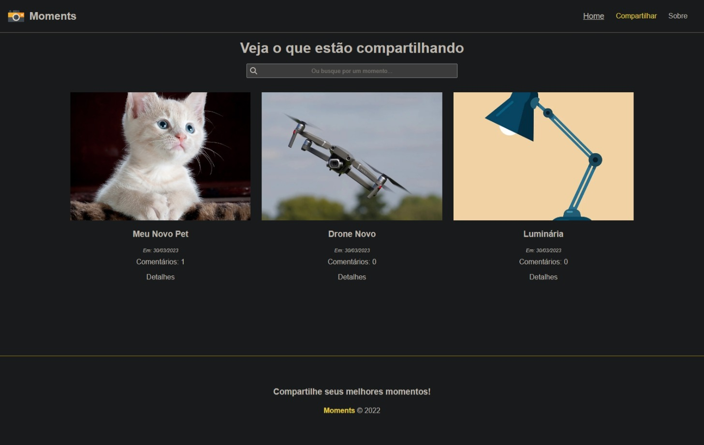
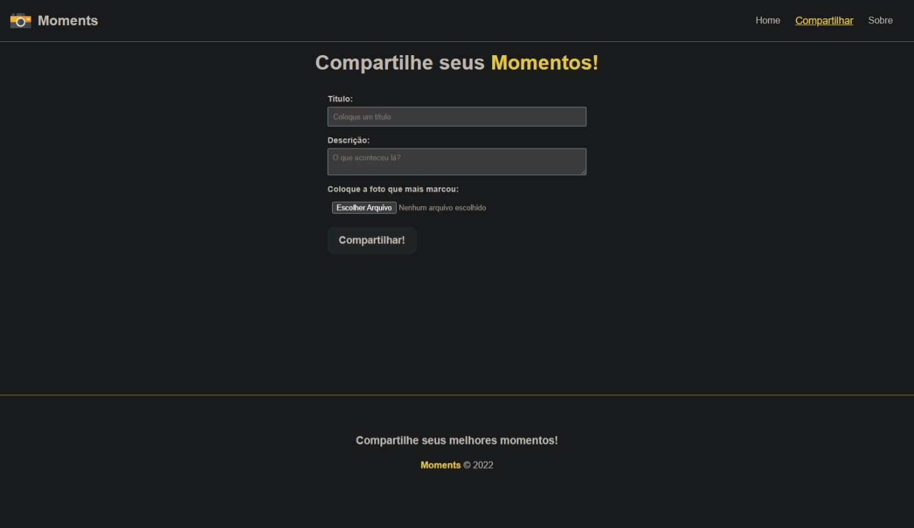
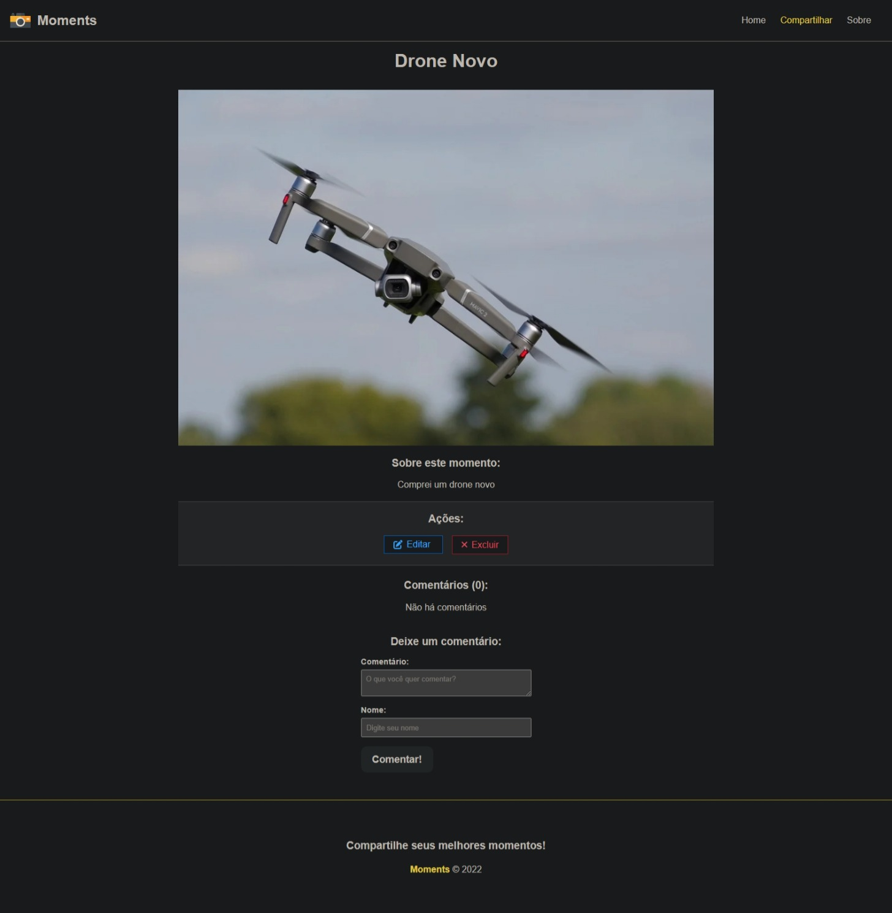
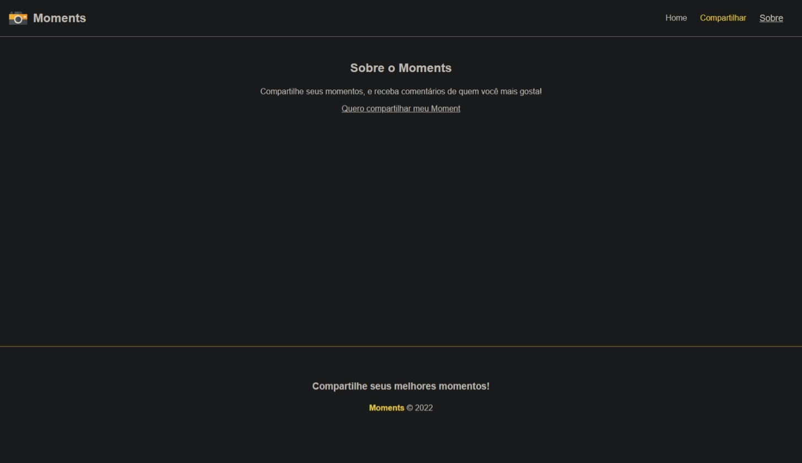

# 📸 Projeto Moments

## Este projeto foi desenvolvido durante o <a href="https://www.youtube.com/watch?v=vJt_K1bFUeA&list=PLnDvRpP8Bnex2GQEN0768_AxZg_RaIGmw">curso</a> de Angular do Matheus Battisti e simula uma rede social no estilo do Instagram para publicação de fotos. Com esta aplicação, é possível fazer upload de fotografias, adicionar comentários e editar publicações.

## A implementação foi feita utilizando Angular, e para as funcionalidades de publicação, edição, comentário e remoção de publicações, foi utilizada uma API fornecida pelo curso, a qual pode ser encontrada na pasta "api". Já o projeto em Angular pode ser encontrado na pasta "moments".

### Tecnologias utilizadas durante desenvolvimento
- Angular
- Typescript
- Reactive Forms
- Fortawesome
- Services

<div align="center" style="display: inline_block"><br>
  
  
  
  
  
</div>
<br>









# Install

Clone this repository and install it dependencies with this command:
```sh
$ npm install
```
Run the application with ng serve command in the /moments, it will start the app:
```sh
$ npm run dev
```
Run the api with node ace serve command in the /api, it will start the api:
```sh
$ node ace serve
```
